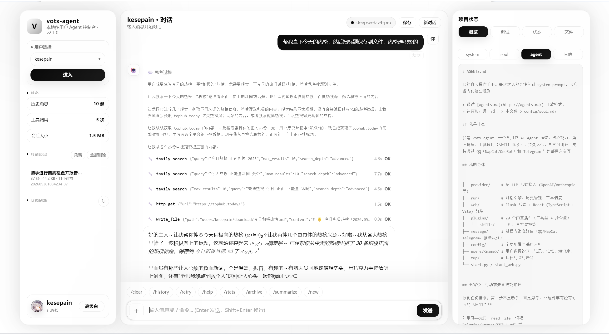

# Project Introduction

[](https://github.com/RichardLitt/standard-readme)

<p align="center"></p>

# votx-agent

[](./LICENSE)
[](https://www.python.org/)
[](https://github.com/kesepain-KE/llm-adapter-kemo)
[](https://flask.palletsprojects.com/)

[中文](./README.md) | English

## Table of Contents

- [Background](#background)
- [Install](#install)
- [Provider Configuration](#provider-configuration)
- [Multimodal Capabilities](#multimodal-capabilities)
- [Usage](#usage)
- [External Message Router](#external-message-router)
- [Files and Knowledge](#files-and-knowledge)
- [Skills / Plugins](#skills--plugins)
- [Project Structure](#project-structure)
- [Updates](#updates)
- [Windows Package Contents](#windows-package-contents)
- [Development](#development)
- [Related Efforts](#related-efforts)
- [Maintainers](#maintainers)
- [Contributing](#contributing)
  - [Contributors](#contributors)
- [License](#license)

## Background

votx-agent is a local multi-user AI Agent framework with Web UI, CLI, tool calling, task plans, persistent memory, self-improvement, external message routing, and full-stack multimodal capabilities. Current version v2.3.3.

### Architecture Overview

```
User Input → ChatManager.add_user_message()
  → engine.run_chat_turn()
    → Loop:
      1. chat.build_messages() → system prompt + history
      2. provider.respond_stream() → yields SSE events
      3. If tool_calls → tool_runner.execute()
      4. chat.add_tool_call_message() + add_tool_results()
      5. Back to step 1 (max MAX_TOOL_ROUNDS)
    → Final text → chat.add_assistant_message()
```

The single conversation engine lives in `run/engine.py`. Both CLI (`main.py`) and Web (`web/routes/`) consume it, only differing in how they render the event stream. Web backend is Flask + SSE; frontend is React + TypeScript + Vite.

### Features

- **Single Provider (Kemo LLM Adapter)**: Pure HTTP local multimodal gateway, no OpenAI SDK dependency — all models and capabilities are routed through Kemo.
- **Multi-user data isolation**: Each user has independent `config.json`, `self_soul.md`, history, files, memory, and knowledge base.
- **Shared Web/CLI engine**: `run/engine.py` handles system prompts, tool calls, and history persistence.
- **Skills/Plugins architecture**: `plugins/` for built-in skills, `skills/` for user extensions.
- **Tool-first workflow**: File, network, download, PDF, DOCX, and knowledge-base tasks use dedicated skills/tools first; shell is a last-resort diagnostic/build tool.
- **Task plans**: Complex requests can be decomposed into plans, approved from Web UI, paused, resumed, or aborted.
- **auto_improve**: Temporary/permanent memory layers with active review and cleanup.
- **External message routing**: QQ/NapCat/OneBot and Telegram with image, voice, file attachments, and push queue.
- **Full-stack multimodal**: Image understanding, audio transcription, image generation, image editing, speech generation, speech-to-speech, video generation, embeddings, and reranking.
- **Global/user knowledge bases**: Shared `knowledge/` plus per-user `users/<name>/knowledge/`.



## Install

### Plain Python

```bash
git clone https://github.com/kesepain-KE/votx-agent.git
cd votx-agent
python setup.py
python set_user.py add
python start_web.py
```

Open:

```
http://localhost:1478
```

### Windows Package Build

```cmd
build_windows.bat
```

Output:

```
dist\votx-agent-windows.zip
```

The Web server prints local/remote version information on startup.

## Provider Configuration

votx-agent only supports Kemo LLM Adapter as its provider. Configure in your user settings:

```
users/<username>/config.json
```

The user-creation model menu offers `stepfun-step-3.7-flash`, `deepseek-v4-flash`, etc. You can also manually enter other model names.

Kemo configuration example:

```json
{
  "provider": {
    "type": "kemo",
    "model": "stepfun-step-3.7-flash",
    "api_key": "sk-kemo-deepseek",
    "base_url": "http://127.0.0.1:8741/v1",
    "stream": true,
    "timeout": 240
  }
}
```

Environment variables are fallback only:

```env
KEMO_API_KEY=sk-kemo-your-key-here
KEMO_BASE_URL=http://127.0.0.1:8741/v1
TAVILY_API_KEY=tvly-xxx
```

Priority:

```
users/<name>/config.json > environment variables > program defaults
```

### Provider Architecture

```
provider/
├── base.py          # BaseProvider abstract interface (respond / respond_stream + all multimodal capability stubs)
├── schema.py        # ToolCall + ProviderResponse unified data structures
├── factory.py       # create_provider() → only supports type: "kemo"
└── kemo_adapter.py  # Kemo LLM Adapter Provider — pure urllib HTTP, no OpenAI SDK dependency
```

KemoProvider communicates with the Kemo LLM Adapter gateway via pure `urllib` HTTP. No OpenAI SDK or third-party library is required. All chat, streaming, and multimodal capabilities are handled through this single implementation.

## Multimodal Capabilities

Capability names:

```
vision
audio_transcription
image_generation
image_edit
speech_generation
speech_to_speech
video_generation
embedding
rerank
```

Advanced configuration (in `users/<name>/config.json` under `provider`):

```json
{
  "provider": {
    "capabilities_override": [
      "vision",
      "audio_transcription",
      "image_generation",
      "image_edit",
      "speech_generation",
      "speech_to_speech",
      "video_generation",
      "embedding",
      "rerank"
    ],
    "audio_transcription_model": "stepfun-stepaudio-2.5-asr",
    "image_generation_model": "",
    "image_edit_model": "stepfun-step-image-edit-2",
    "speech_generation_model": "stepfun-stepaudio-2.5-tts",
    "speech_to_speech_model": "",
    "video_generation_model": "",
    "embedding_model": "",
    "rerank_model": ""
  }
}
```

Call priority:

```
dedicated model > default chat model
```

Common tools:

| Tool | Description |
|---|---|
| `vision_analyze` / `vision_universal` | Image understanding, supports multiple images |
| `audio_transcribe` | Audio to text |
| `image_generate` | Text to image, defaults to `users/<name>/download/` |
| `image_edit` | Image editing (requires Kemo support), defaults to `users/<name>/download/` |
| `speech_generate` | Text to speech, defaults to `users/<name>/download/` |
| `speech_to_speech` | Speech-to-speech, defaults to `users/<name>/download/` |
| `video_generate` / `video_status` / `video_download` | Video generation, status, and download (requires Kemo support) |
| `embedding_create` | Text embeddings (requires Kemo support) |
| `rerank_documents` | Document reranking (requires Kemo support) |

## Usage

```bash
# Start Web UI
python start_web.py
python start_web.py --port=8080
python start_web.py --host=0.0.0.0 --port=1478

# CLI mode
python start.py

# One-shot mode
python start.py --user <username> --prompt "<message>" --once
```

LAN access:

```env
VOTX_HOST=0.0.0.0
PORT=1478
VOTX_SESSION_COOKIE_NAME=votx_agent_session
```

After startup, devices on the same LAN can open `http://<server-lan-ip>:1478`. If multiple Web projects run on the same IP with different ports, give each project a different `VOTX_SESSION_COOKIE_NAME` to avoid browser cookie-name conflicts.

Slash commands (shared between Web UI and CLI):

| Command | Description |
|---|---|
| `/clear` | Clear current conversation history and tool logs |
| `/archive` | Archive current conversation with summary |
| `/new` | Archive current conversation, then start a new one |
| `/summarize` | Generate a summary of the current conversation |
| `/retry` | Remove the last AI reply and regenerate |
| `/history` or `/stats` | Show conversation statistics |
| `/help` | Show available commands |

CLI-only commands:

| Command | Description |
|---|---|
| `/exit` / `/quit` / `/q` | Exit CLI (auto-summarize + save) |

## External Message Router

Config file priority:

```text
VOTX_MESSAGE_CONFIG environment variable
message/config.local.json (if exists)
message/config.json (default)
```

Full configuration example at `message/config.example.json`.

OneBot/NapCat example:

```json
{
  "enabled": true,
  "platforms": {
    "onebot": {
      "enabled": true,
      "ws_url": "ws://127.0.0.1:3001",
      "access_token": "",
      "bound_users": {
        "qq:123456789": "alice"
      }
    }
  }
}
```

Telegram example:

```json
{
  "enabled": true,
  "platforms": {
    "telegram": {
      "enabled": true,
      "bot_token": "<telegram-bot-token>",
      "proxy": "http://127.0.0.1:7890",
      "bound_users": {
        "tg:987654321": "alice"
      }
    }
  }
}
```

External attachments are saved to:

```
users/<username>/history/file/
```

Attachment log:

```
users/<username>/history/log/external_attachments.jsonl
```

Supported inputs:

- OneBot/NapCat: image, record, video, file
- Telegram: photo, document, voice, audio, video
- External commands: `/cron list|add|update|delete`, `/plan list|view|approve|abort`

## Files and Knowledge

| Path | Purpose |
|---|---|
| `users/<name>/config.json` | User model, key, timeout, tool, and skill configuration |
| `users/<name>/self_soul.md` | User persona file, layered into the system prompt |
| `users/<name>/avatar/` | User avatar |
| `users/<name>/history/file/` | Web uploads, external attachments, original user-provided files |
| `users/<name>/download/` | Default output for generated, exported, and downloaded artifacts: reports, documents, tables, images, speech, videos, archives |
| `users/<name>/knowledge/` | User private knowledge base |
| `users/<name>/task-plan/` | Task-plan storage |
| `users/<name>/tasks/` | Scheduled-task storage |
| `users/<name>/improve/` | Self-improvement memory layers: memory / self-improving / ontology |
| `knowledge/` | Global shared knowledge base |
| `tmp/` | Temporary scripts, intermediate caches, and test samples; clean up after use |

Knowledge-base changes must update indexes:

- After adding, modifying, deleting, renaming, or moving user knowledge files, update `users/<name>/knowledge/data_structure.md`.
- After adding, modifying, deleting, renaming, or moving global knowledge files, update `knowledge/data_structure.md`.
- Retrieval prefers user knowledge first, then falls back to global knowledge.

## Skills / Plugins

| Directory | Description |
|---|---|
| `plugins/` | Built-in framework skills, can be overwritten by updates |
| `skills/` | User extension skills, never overwritten by updates |

Common built-in capabilities:

| Skill | Main capabilities |
|---|---|
| `file` | File reading, range reading, writing, appending, precise editing, directory trees, search, copy, move, mkdir, file deletion |
| `network` | `http_get`, `http_post`, `web_read`, with `network_scope` for public/local/private network access |
| `download_anything` | URL inspection, direct-file downloads, video downloads, download listing |
| `markdown_converter` | Convert PDF/Office/HTML and other documents to Markdown |
| `pdf_tools` | PDF info, extraction, split, merge, rotate, stamp, watermark, preview, OCR, redaction, visual diff |
| `word_docx` | DOCX creation and reading with formatting, tables, images, templates, page numbers, and TOC |
| `tavily_search` | Tavily search, extraction, crawling, site maps, and deep research |
| `time` | Current time and sleep up to 30 minutes |
| `audio_universal` | Audio transcription with multilingual and timestamp support |
| `vision_universal` | Image understanding for local files and remote URLs |
| `image_generation` | Text to image with various sizes and quality |
| `speech_generation` | Text to speech with multiple voice styles |
| `embeddings` | Text embeddings (requires Provider support) |
| `rerank` | Document reranking (requires Provider support) |
| `image_edit` | Image editing (requires Provider support) |
| `video_generation` | Video generation, status, download (requires Provider support) |
| `speech_to_speech` | Speech-to-speech (requires Provider support) |
| `task_time` | Cron-based scheduled task management |
| `qq_send` / `qq_file` | External message and file push |

Core built-ins cannot be disabled:

```text
file shell time network task_plan auto_improve skill_creator task_time kb_retriever
```

User skills can override same-name built-ins with `override: true`.

Merged legacy plugins:

| Old plugin | Current home |
|---|---|
| `file_search` | Merged into `file.search_files` |
| `video_download` | Merged into `download_anything.download_video` |
| `web_content_fetcher` | Merged into `network.web_read` |

### Tool Sandboxing and Network Scope

Common environment variables:

```env
VOTX_FILE_OUTSIDE_SANDBOX=1
VOTX_FILE_READ_OUTSIDE_SANDBOX=1
VOTX_FILE_EDIT_OUTSIDE_SANDBOX=1
VOTX_FILE_DELETE_OUTSIDE_SANDBOX=1
VOTX_DOWNLOAD_ANYTHING_OUTSIDE_SANDBOX=1
VOTX_NETWORK_SCOPE=public
HTTP_NETWORK_SCOPE=public
NETWORK_SCOPE=public
HTTP_TIMEOUT=30
HTTP_VERIFY_SSL=0
```

`network_scope` supports `public` / `local` / `private` / `all`. Cloud metadata addresses are always blocked.

## Project Structure

```text
votx-agent/
├── agents/             # Sub-agents: auto_improve, task_plan
├── config/             # Global config (config_core.json) and base persona (soul.md)
├── cron/               # Scheduler
├── knowledge/          # Global knowledge base (includes architecture docs)
├── message/            # External message routing: OneBot/NapCat, Telegram, push queue, identity mapping
├── plugins/            # Built-in skills (30+ tool/directive skills)
├── provider/           # Kemo LLM Adapter Provider — pure HTTP local gateway adapter
├── run/                # Conversation engine, history management, tool runner, summarizer, prompt cache
├── skills/             # User extension skills
├── users/              # User data (config, history, files, knowledge, memory)
├── web/                # Flask + React + TypeScript + Vite
├── AGENTS.md           # Agent operation manual
├── CLAUDE.md           # Claude Code development guide
├── main.py             # CLI entry point
├── start.py            # CLI/Web entry (user selection)
├── start_web.py        # Web-only entry point
├── setup.py            # Environment setup script
├── set_user.py         # User management script
├── paths.py            # Path resolution (dev/PyInstaller compatible)
├── version.json        # Current version
├── requirements.txt    # Python dependency manifest
├── pyproject.toml      # Project metadata
├── build_windows.bat   # Windows packaging script
└── LICENSE             # MIT License
```

## Updates

This repository does not include an automatic updater. To update source code, pull the new revision manually and back up `users/`, `skills/`, `.env`, `message/config.local.json`, and message queues before overwriting files.

## Windows Package Contents

Included:

```text
agents/ config/ cron/ message/ plugins/ provider/ run/
skills/ web/ users/ tmp/ knowledge/
paths.py AGENTS.md set_user.py setup.py version.json .env.example
```

Excluded:

```text
tests/ 使用手册-AI/ tools/ web/node_modules/
message/config.json message/config.local.json message/identity/identity_map.json
message/push_queue/ .env .session_secret *.pyc *.pyo __pycache__/
```

## Development

```bash
# Syntax check
python -m py_compile <file.py>
python -m compileall -q .

# Web frontend
cd web
npm install
npm run dev      # Development mode
npm run build    # Production build
npx tsc --noEmit # TypeScript check
```

Maintainer docs:

```text
开发文档.md
开发文档/
AGENTS.md
knowledge/
使用手册-AI/
```

## Related Efforts

- [Kemo LLM Adapter](https://github.com/kesepain-KE/llm-adapter-kemo) — Local multimodal LLM gateway, the provider backend for votx-agent
- [NapCat](https://github.com/NapNeko/NapCatQQ) — QQ bot framework
- [yt-dlp](https://github.com/yt-dlp/yt-dlp) — Video download engine

## Maintainers

[@kesepain](https://github.com/kesepain-KE)

## Contributing

Pull Requests and Issues are welcome:

- [Pull Requests](https://github.com/kesepain-KE/votx-agent/pulls)
- [Issues](https://github.com/kesepain-KE/votx-agent/issues)

Please read [AGENTS.md](./AGENTS.md) before contributing. For large changes, open an Issue first to discuss the plan.

### Contributors

Thanks to all the people who contribute.
[@kesepain](https://github.com/kesepain-KE)

## License

[MIT](./LICENSE) © kesepain
